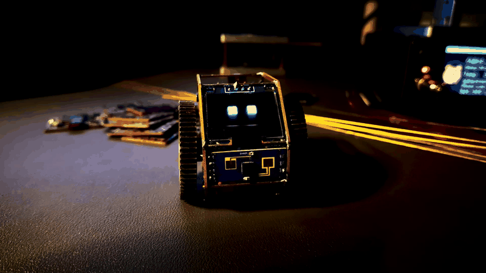
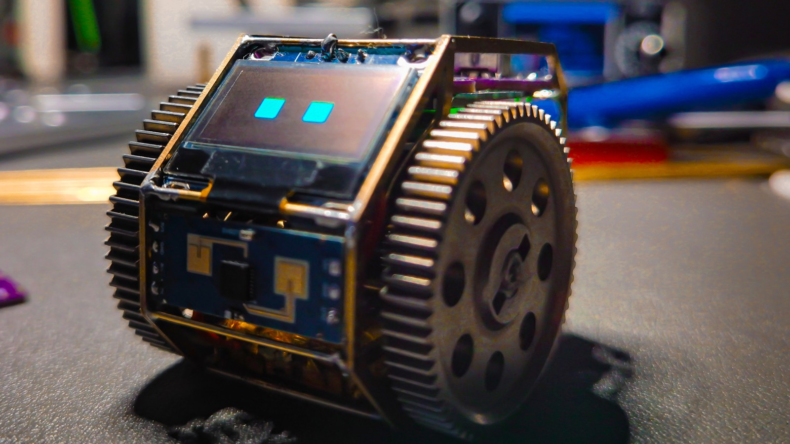
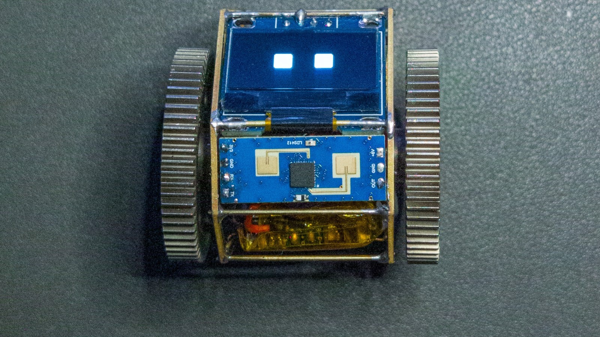
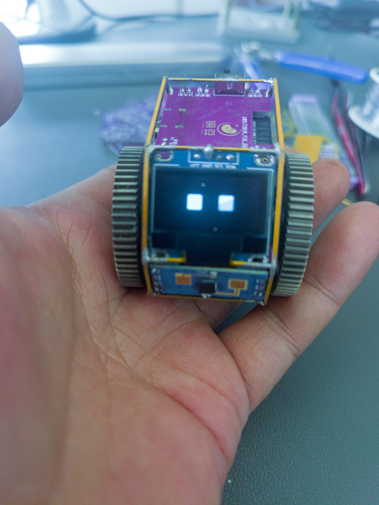
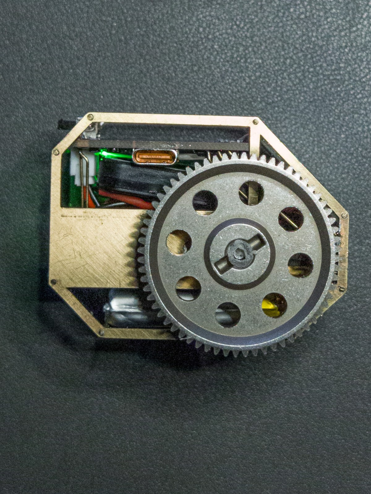

# TongDou

## Featured on Hackaday

TongDou was featured on Hackaday:

**[Tiny Desktop Robot Has Radar →](https://hackaday.com/2026/07/31/tiny-desktop-robot-has-radar/)**

Written by Zoe Skyforest · July 31, 2026

> **Work in Progress**
>
> TongDou is being actively documented and open-sourced step by step.
> Hardware test firmware, prototype photos, and selected hardware documents are
> public now. Other design files, manufacturing documents, and build guides will
> be released progressively.
> Please see the [Roadmap](#roadmap) below for the current release plan.

TongDou is a small desktop robot that has already been physically built and run. It is not a concept project.

This repository is the official public project showcase and phased open-source entry point for TongDou.

Official website: https://gettongdou.com
Contact: hello@gettongdou.com

Official TongDou products and crowdfunding campaigns will only be announced through https://gettongdou.com

## Prototype Photos

## Watch TongDou Run

Open the local showcase page:

[TongDou public showcase](index.html)

The showcase page uses a muted, looping video so it can autoplay in normal browsers.

Full video:

[TongDou demo - Devil Descends](media/videos/tongdou-demo-devil-descends.mp4)

## Hardware Test Firmware

[Open the TongDou hardware test firmware](hardware_test_firmware/)

This public package is intended for hardware bring-up and diagnostics. It is
not the complete TongDou application firmware.

## V8 and V9 PCB Revisions

### V8 prototype PCB

### V9 prototype PCB

These are the real V8 and V9 prototype boards. V9 adds a capacitive touch logo
and an onboard QMI8658A 6-axis IMU.

## Current Public Release

This repository currently includes:

- Project overview
- Hardware test and diagnostic firmware
- V8 and V9 prototype PCB photos
- Existing schematic PDF files
- Existing project photos and videos
- License and notice files
- Open-source release plan

The hardware test firmware is not the complete TongDou application firmware.

Current schematic PDFs:

- [Main control schematic](hardware/schematic/tongdou-pcb-v8-schematic-main-control.pdf)
- [Power schematic](hardware/schematic/tongdou-pcb-v8-schematic-power.pdf)

Media folders:

- [Images](media/images/)
- [Videos](media/videos/)

Current public video:

- [TongDou demo - Devil Descends](media/videos/tongdou-demo-devil-descends.mp4)

## What Is Not Included Yet

This repository does not currently provide:

- Complete TongDou application firmware
- Editable PCB source files
- Gerber files
- BOM and pick-and-place files
- Mechanical source files
- Production calibration and manufacturing files
- Character behaviors
- Official audio assets
- Private data, keys, backend configuration, and service credentials
- Complete manufacturing or assembly tutorials
- Cost, supply-chain, or purchasing lists

These materials are not permanently closed. Complete project materials are
planned to be released progressively after the crowdfunding campaign is complete
and the first production batch has been delivered.

No specific open-source release date is promised at this stage.

## Roadmap

### 1. Public project showcase

Photos, videos, high-level project description, license information, and the
public release route.

### 2. Hardware test firmware

The public hardware test firmware is available now for board bring-up and
diagnostics. It is not the complete TongDou application firmware.

### 3. Additional hardware design materials

Existing schematic PDFs are available now. Editable PCB source files, Gerber
files, BOM, pick-and-place files, mechanical source files, and production
calibration and manufacturing files are not published yet.

Further hardware notes and validation records will be added progressively.

### 4. Assembly and validation records

Brass-frame soldering, assembly, power-on checks, testing records, and
troubleshooting material.

## TongDou PCB v8

The current electrical reference documents are available in:

- [Main control schematic](hardware/schematic/tongdou-pcb-v8-schematic-main-control.pdf)
- [Power schematic](hardware/schematic/tongdou-pcb-v8-schematic-power.pdf)

TongDou as a whole is still being released in phases and is not yet a complete
end-to-end manufacturing kit.

V9 hardware bring-up is in progress. V9 adds the QMI8658A motion sensor, the
TongDou logo touch input on IO4, and AT8833CT nFAULT feedback on IO37. The V8
and V9 prototype PCB photos are now included. V9 files are not yet part of the
published manufacturing package.

## Why The Release Is Phased

TongDou is a real hardware product, not only a document package. Some files can be used to directly manufacture, clone, or misrepresent the product before the first official release is ready.

For this stage, the public repository is intentionally limited to project presentation, schematic-level reference, real media, hardware test firmware, licensing boundaries, and the future open-source path.

## License Scope

The root [LICENSE](LICENSE) file contains the CERN Open Hardware Licence Version 2 - Permissive, also known as `CERN-OHL-P-2.0`.

At the current stage, that license only applies to schematic PDF files in this repository that are explicitly marked as open hardware materials.

Photos, videos, README content, website content, the TongDou name, logo, character identity, official audio, promotional materials, packaging, complete application firmware, PCB source files, Gerber files, BOM files, PNP files, mechanical files, production calibration files, manufacturing files, and fixtures are not included in the open hardware license unless a future release clearly says otherwise.

See [NOTICE.md](NOTICE.md) for the exact boundary.

## Official Product Boundary

Third-party products must not be presented as official TongDou products.

Third parties must not claim official TongDou certification, approval, endorsement, or crowdfunding participation unless that status is announced through the official website.

Official TongDou products and crowdfunding campaigns will only be announced through https://gettongdou.com

## Repository Documents

- [Hardware Test Firmware](hardware_test_firmware/)
- [License Scope and Attribution](NOTICE.md)

## Inspiration & Acknowledgements

TongDou's brass-and-PCB aesthetic and compact mechanical form were deeply
inspired by the incredible craftsmanship of **Huy Vector** of
**Huy Vector Lab**, particularly the desktop robot **Mo-chan**, as shown
in [this original build video](https://www.youtube.com/watch?v=3hjvpyjxPsk).

I'm a huge fan of Huy's work and highly recommend exploring the original
projects and [Huy Vector on YouTube](https://www.youtube.com/@huyvector).

Thank you, Huy, for inspiring TongDou and for showing how beautifully brass,
PCBs, and mechanical structures can be brought to life.

TongDou's electronics, PCB, brass frame, original soldering and alignment
fixture, firmware, character design, and interaction system were independently
developed for this project.

## Community & Contact

> **Note:** TongDou is currently a solo-maker project. To keep my focus on
> hardware development, firmware polishing, documentation, and the early
> tester program, GitHub Issues and Discussions are temporarily disabled.
>
> To follow project updates, join the waitlist, or apply for the early tester
> program, please visit the [TongDou official website](https://gettongdou.com)
> and read the [Tester Program & Agreement](https://gettongdou.com/tester-agreement.html).
>
> For essential project, media, licensing, or collaboration inquiries:
> **[hello@gettongdou.com](mailto:hello@gettongdou.com)**
>
> Thank you for your patience while I build and document TongDou step by step.
