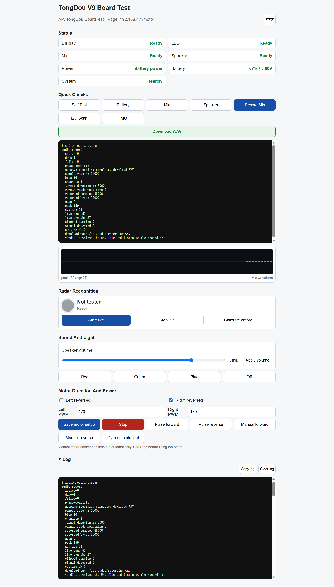

# TongDou V9 Engineering Test, Diagnostics, Calibration & Maintenance Firmware

This is the same engineering firmware I use on my workbench to bring up,
diagnose, calibrate, and repair TongDou V9 hardware.

It grew alongside the hardware, so you may find experimental paths, diagnostic
commands, and traces of real debugging work. That is intentional - this
repository reflects how TongDou was actually developed, not a cleaned-up demo
written afterward.

This is not the complete TongDou application firmware. It does not include the
character behavior system, official audio assets, scripted scenes, cloud voice
features, or the final user-facing product experience.

## Target Hardware

This firmware targets TongDou V9 hardware:

- ESP32-S3-MINI-1-N4R2 module
- 0.96 inch OLED on I2C
- SK6812-EC20 status LED
- IM72D128V01 PDM digital microphone
- NS4168 I2S speaker amplifier
- AT8833CT dual motor driver with nFAULT feedback
- QMI8658A 6-axis IMU
- Capacitive touch TongDou logo
- LD2412 radar module
- TP4057 charging and battery monitoring circuit

## Build System

The project uses PlatformIO, not a native ESP-IDF project.

Main firmware path:

```text
hardware_test_firmware/firmware
```

Current PlatformIO configuration:

- Environment: `esp32s3`
- Platform: `platformio/espressif32@6.10.0`
- Board: `esp32-s3-devkitc-1`
- Framework: Arduino
- Flash size used by this project: 4 MB
- Flash mode: DIO
- Partition table: `huge_app.csv`
- C++ standard: GNU++17
- USB serial on boot: enabled
- Upload speed: 460800
- Extra upload helper: `tools/chunked_upload.py`

Developer build:

```bash
cd hardware_test_firmware/firmware
platformio run
```

Chunked upload, useful when the USB serial port drops during a large app write:

```bash
cd hardware_test_firmware/firmware
platformio run -t upload_chunked --upload-port COM13
```

Change `COM13` to the actual Windows serial port.

## Public Flash Package

For users who do not want to install PlatformIO, use the release ZIP package.
It includes the prebuilt merged image, a one-click Windows flash script, and
the official Espressif esptool standalone Windows executable.

Recommended entry point:

```text
FLASH_TONGDOU.bat
```

The script flashes:

```text
TongDou_V9_Hardware_Test_v1.0.bin
```

at address:

```text
0x0
```

The merged image is generated from the PlatformIO build outputs:

| Address | File |
| --- | --- |
| `0x0` | `bootloader.bin` |
| `0x8000` | `partitions.bin` |
| `0xe000` | `boot_app0.bin` |
| `0x10000` | `firmware.bin` |

The included flash tool is:

- esptool v5.3.1
- Official project: `https://github.com/espressif/esptool`
- Official release: `https://github.com/espressif/esptool/releases/tag/v5.3.1`
- License: GPL-2.0-or-later

The release package keeps `Flash_Tool/LICENSE` and
`Flash_Tool/SOURCE_AND_LICENSE.txt`.

See `QUICK_FLASH_GUIDE_EN.md` or `QUICK_FLASH_GUIDE_CN.md` for the user-facing
flashing steps.

## Web Diagnostics Page

After flashing, TongDou starts an open access point:

```text
TongDou-BoardTest
```

Connect to that network and open:

```text
http://192.168.4.1/motor
```



The web page is the normal workbench page for common checks:

- System status
- OLED test
- SK6812-EC20 red, green, blue, and off test
- Microphone recording with waveform preview and WAV download
- Speaker test tone and volume slider
- Battery voltage and estimated percentage
- I2C and QMI8658A IMU checks
- Logo touch check
- LD2412 live presence and distance status
- Left and right motor manual tests
- Motor configuration
- Gyro-assisted straight-line motor test
- Shipping discharge helper
- Collapsible logs with copy and clear actions

## Serial Diagnostics

The serial console keeps the deeper engineering commands that are not always
needed on the web page.

Common commands include:

- `help`
- `status`
- `selftest`
- `battery`
- `i2c scan`
- `imu`
- `imu raw test`
- `mic`
- `mic mode`
- `mic mode [0-17]`
- `audio record`
- `audio record status`
- `audio loopback`
- `audio loopback status`
- `audio loopback stop`
- `speaker`
- `audio volume [0-100]`
- `led red`
- `led green`
- `led blue`
- `led off`
- `led pin high`
- `led pin low`
- `led pin pulse`
- `logo touch`
- `logo touch watch`
- `radar`
- `radar target`
- `radar sample`
- `radar samples`
- `radar parser selftest`
- `radar guided test`
- `radar guided status`
- `radar guided blocking`
- `radar config`
- `radar sensitivity`
- `radar engineering on`
- `radar engineering off`
- `radar desk`
- `radar near`
- `radar resolution`
- `radar res20`
- `radar calibrate`
- `radar calibrate status`
- `radar bridge`
- `radar factory reset`
- `motor forward`
- `motor reverse`
- `motor stop`
- `motor manual forward [leftPwm rightPwm]`
- `motor manual reverse [leftPwm rightPwm]`
- `motor auto forward [basePwm]`
- `motor auto status`
- `motor diag a`
- `motor diag b`
- `motor cal forward [leftStart rightStart leftHold rightHold]`
- `motor cal reverse [leftStart rightStart leftHold rightHold]`
- `motor cal stop`
- `shipping discharge start`
- `shipping discharge status`
- `shipping discharge stop`

See `docs/HARDWARE_TESTS.md` for the current command details.

## High-Risk Maintenance Commands

Some commands are intentionally powerful because this is a real maintenance
firmware.

Use extra care with:

- Persistent motor configuration
- Motor direction changes
- Motor calibration
- `motor auto forward`
- Long motor runs
- Radar parameter writes
- `radar factory reset`
- `shipping discharge start`

These operations may drive motors, modify Flash configuration, change LD2412
module parameters, keep hardware active for a long time, or change the current
test state of the board. They are kept because they are useful for repair and
bring-up, not because they are safe for casual clicking.

## Sub-Firmware

`qmi8658a_test_firmware/` is a small standalone smoke test used for early
QMI8658A and basic peripheral bring-up.

`led_data_high_test_firmware/` is a temporary diagnostic sub-firmware for an
LED data-line investigation. It is not part of the main hardware test firmware
release unless explicitly included by the maintainer.

## What Is Not Included

This package does not include:

- Complete TongDou application firmware
- Character behaviors or personality prompts
- Official voice clips or audio assets
- Full expression, light, voice, and motor timelines
- Full scripted scenes
- Cloud voice, ASR, LLM, TTS, or MCP application logic
- PCB source projects, Gerber files, BOM, or pick-and-place files
- Mechanical source files or fixtures
- Production manufacturing files
- Wi-Fi passwords, API keys, tokens, certificates, or private keys

## Current V9 Notes

- Pins have been updated to match the V9 PCB.
- The LED path now targets SK6812-EC20 instead of the old WS2812 assumption.
- The microphone test has been consolidated into a normal recording flow with
  waveform display and WAV download.
- LD2412 radar diagnostics have been tested with empty-scene and hand-motion
  checks. If the radar module is replaced or its mounting direction changes,
  run empty-scene background calibration again.
